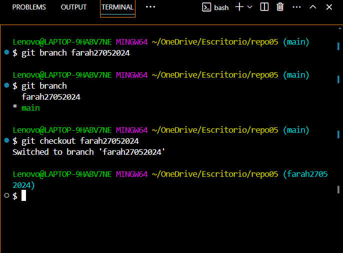
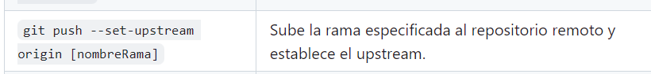

# Ejercicio 5

### Enunciado ->


### 5.1 y 5.2
Creamos un repositorio remoto, y lo clonamos.
Añadimos un fichero md (se puede añadir desde remoto como desde local) para ir documentando todos los pasos.    
- `git clone [url]`
- `touch readme.md`  
- `git add .`  
- `git commit -m "txt"`  
- `git push`


### 5.3



### 5.4


### 5.5

 


### 5.6


### 5.7


### 5.8

En Git, hay dos tipos principales de estrategias de fusión (merge): Fast-Forward (FF) y No Fast-Forward (No FF). A continuación, se explican las diferencias entre ambas:

## Fast-Forward (FF)

- **Definición**: Un merge Fast-Forward ocurre cuando la rama que se va a fusionar puede avanzar directamente hasta la rama de destino sin crear un nuevo commit de fusión.
- **Uso**: Se usa cuando la rama de destino no ha cambiado desde que se creó la rama de trabajo.
- **Resultado**: La historia del repositorio es lineal, sin commits de fusión adicionales.
- **Comando**:  
  
  ```bash
  git merge [rama]
## No Fast-Forward (No FF)

- **Definición**: Un merge No Fast-Forward se usa para preservar la historia de las ramas. Crea un nuevo commit de fusión, incluso si la fusión podría hacerse como un Fast-Forward.
- **Uso**: Es útil para mantener un registro claro de cuándo se han fusionado ramas.
- **Resultado**: La historia del repositorio incluye un commit de fusión, lo que puede ayudar a comprender el flujo de trabajo.
- **Comando**:
  
  ```bash
  git merge --no-ff [rama]
